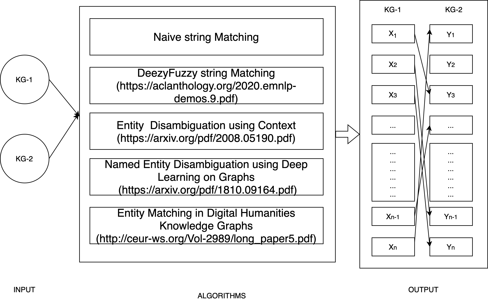

# ENTITY LINKING ON HISTORICAL DATA

```
entity_linking
|   README.md
|   main.py
└───nmvwdatadump
|   |   data_dump.py
|   |   filter_wiki_human.py
└───naive
|   |   naive_string_matching.py
└───dezzymatch
|   └───data
|   └───inputs
|   |   deezy_match_data_construction.py
|   |   fuzzy_string_matching.py
|   |   line_count_text_file.py
|   |   deezymatch.ipynb
└───utils
|   |   utils.py
|   |   result.py
└───exp100
|   └───data
|   └───results
|   └───k_fold_validation
|   |   construct_ground_truth.py
|   |   exp100.ipynb
|   |   README.md
└───exp200
|   └───data
|   └───results
|   |   README.md
|   |   bronbeek_const_data_processing.py
|   |   bronbeekDeezyMatchExp.ipynb
```

## Task Description
Given two (or more) Knowledge Graph, the task is to find the corresponding links of two person instance from two different data sources that indicates the same real-world person. <br>


[edit_image](https://app.diagrams.net/#G1ZMdnviCDEguLUWB5kzItnAMo7Y3TQBse)
## Experiment Look-up Table

| Experiment no. | Data | Query size | Candidate size | Algorithms |  Evaluation | Task/ Description | File | 
| ----------- | ----------- | ----------- | ----------- | ----------- | ----------- | -----------| ----------- |
| exp100 | NMVW-Wikidata |  6178 | -(all wikidata person instance) | Naive, DeezyMatch | Based on Ground Truth | Retrieve wikidata identifier based on generated candidate| [File](exp100) | 
| exp300 | NMVW-Wikidata | 6178 | 11501 | Naive, Abbrv. Match, Surname Match, Fuzzy String, Match |  Based on human evaluation | Match X to corresponding Y| [File](exp300/exp300.ipynb) | 
| ~~exp200~~ | ~~NMVW-Bronbeek~~ | - |~~(num of NMVW) - (num of Bronbeek)~~ | ~~Naive, DeezyMatch~~ |  ~~Based on human evaluation~~ | ~~Match X to corresponding Y~~| [~~File~~](exp200/exp200) | 
| exp201 | Bronbeek-NMVW | 15382 (num of Bronbeek)| 39567 (num of NMVW)| Naive, Abbrv. Match, Surname Match, Fuzzy String, Match |  Based on human evaluation | Match X to corresponding Y| [File](./exp201/exp201.ipynb) | 

## Evaluation 
Report on Recall, Precision and F-score [code](utils/calculate_result.py)