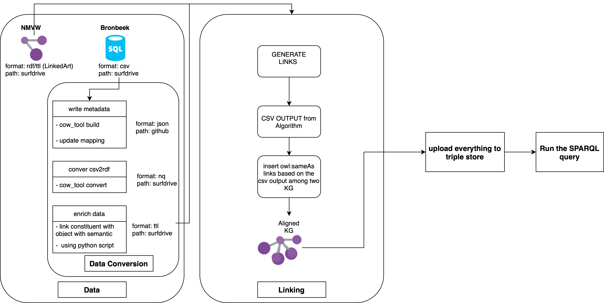

<center>Figure: Pipeline to folow to recreate query results</center>


[edit](https://app.diagrams.net/#G16X1PiVgtSVrZNMkEIWW3eY17JztUH5w4#%7B%22pageId%22%3A%22prtHgNgQTEPvFCAcTncT%22%7D)

## Data Extraction and Conversion

In this work, it is expected that user already have the Wereldmuseum data dump, therefore can ignore the following subsection and move to the `Bronbeek Data Conversion` section.

### Wereldmuseum (formerly known as NMVW) data extraction
Using this [script](data_preparation/nmvwdatadump/data_dump.py), Wereldmuseum data was extracted from a remote server.

The `run` function the script retrieves data from an endpoint by making API requests with specified data ranges. It saves the response data as files in the `nmvw_data' directory, organized by the specified component(e.g, ccrdf, ccrdfcont etc). The function loops through the entire data range, making consecutive API (as it cannot make the entire dump altogether) calls until it reaches or exceeds the highest value for the range. It handles various exceptions that may occur during the process, such as network errors, empty responses, and conversion errors. It logs encountered errors to separate text files for further analysis.

```
def run(component, highest_value, range, start_limit=1):
    """
    Extract data from an endpoint and store it in files.

    :param component: (str) Specifies which component to access from the endpoint.
    :param highest_value: (int) The possible highest number for the component range.
    :param range: (int) The range of data to request in each API call.
    :param start_limit: (int) Default is 1; indicates the starting range value for the GET request.
    """
```
Example usage:
```run(component='ccrdfconst', highest_value=58000, range=20)```

### Bronbeek Data Conversion

#### Step-1: convert csv to n-quad using cow_tool

[convert_csv2rdf](data_preparation/bronbeekdataconversion/convert_csv2rdf.py) script convert csv files into nq files based on the conversion metadata specifciations of the csv files in folder [conversion_metadata](data_preparation/bronbeekdataConversion/conversion_metadata). 
     - To run this script you need to provide path-to-directory where your csv and metadata is stored.


> Note: convert_csv2rdf.convert_csv_to_rdf() expects your csv and conversion metadata json file is in the same folder.

#### Step-2: Upload to cliopatria

1. compress the .nq files with bash command
   ```bash
   gzip <path-to-folder>/*.nq
   ```

2. from cliopatria CLI, type
   ```
   # attach the libraries
   rdf_library:rdf_attach_library(<path-to-folder-of-void.ttl>).
   ```
> Note: [void.ttl](data_preparation/bronbeekdataConversion/void.ttl) expects triple files are in the same folder as void.ttl.
   ```
   # upload files by library
   rdf_load_library('<library-name>').
   e.g., rdf_library:rdf_load_library('bronbeek').
   ```

#### Step-3: Data Enrichment
Linked data enrichment with the [enrich_data_bronbeek.py](data_preparation/bronbeekdataConversion/enrich_data_bronbeek.py) script to add provenance activity (i.e., acqusition events, former owner and objects related to person.)

```bash
python enrich_data_bronbeek.py <folder-path-of-all-nq-files>
```
> [enrich_data_bronbeek.py](data_preparation/bronbeekdataConversion/enrich_data_bronbeek.py) expects .nq files.


## Entity Alignment
 [entity_alignment](entity_alignment) directory contains a set of Python scripts and experiments designed to perform various string matching tasks. The scripts provided cover a range of matching techniques, including exact string matching, intial+surname(abbraviation) matching, surname matching and fuzzy string matching,.

### Supported String Matching Strategies

##### 1. Exact String Matching: 
The script, [match_exact_string.py](entity_alignment/matchexactstring/match_exact_string.py), deals with exact string matching. It provides a straightforward method to match strings precisely, without considering any variations or similarities.

##### 2. Initial+Surname Match: 
The script, [match_with_abbreviation.py](entity_alignment/matchwithabbreviation/match_with_abbreviation.py), is dedicated to initial+surname matching. It implements a method to extract initials from a given name or a name with specific patterns. It intelligently handles various cases, ensuring accurate extraction and formatting of initials.

##### 3. Surname Match: 
The script, [match_surname.py](entity_alignment/matchsurname/match_surname.py), focuses on surname matching. It provides functionality to compare and match surnames, considering variations and common misspellings.

##### 4. Fuzzy String Match: 
[match_fuzzy_string.py](entity_alignment/matchfuzzystring/match_fuzzy_string.py) script is designed for fuzzy string matching. It employs algorithms that allow for matching strings that are similar but not necessarily identical, considering typos, variations, and other discrepancies.

##### 5. DeezyMatch:

The deezy match trained and fine-tuned under a different repo. 
For more detail please visit git repo: https://github.com/Shoilee/deezymatch_jrcnames

The trained model and the execution code can be found [here](entity_alignment/deezymatch/deezymatch.ipynb).

### Generate Links:
Based on selected technique, [this](entity_alignment/nmvw_bronbeek/create_links.py) script creates an RDF link graph by linking entities from a given dataset with entities from another source. It uses the RDFLib library to create an RDF graph and generates OWL sameAs links between corresponding entities.

```
python create_link_graph.py <input_file_path>
```

The `input_file_path` expects to be a tsv(tab seperated format) file that contains the results of already aligned rows from two dataset based on the specific selected technique; where `nmvw_uri` is the same as corresponding `constituentID` from bronbeek.


### Pscedu-ground Truth 
[Experiment on Pseudo-ground Truth](entity_alignment/ground_truth/exp300.ipynb) script represents experiment with pseudo-ground truth data, which involves running different variations of the matching algorithms and generating results. Please refer to the script for detailed information on the experiment.

### Random Sample 
Similarly, [Evalaution on randon sample](exp202/exp202.ipynb) script represents experiment with Wereldmuseum persons vs Bronbeek person name. Please, refer to the script for detailed insights.

TODO: add detail about how it was evaluated.


## Knowledge Discovery
The detail steps of the conversion from the Competency question to the question answered by the SPARQL Query.
|       | **Original Competency Question(CQ)**                                           | **Instance of CQ based on dataset**                                                                                                                                        | **Information retrieval question to support CQ**                                                                                                                                                                           | **Query used to report result ($\Delta H_{CQ})$**                                                                                                                                                                               |
|-------|-------------------------------------------------------------------------------------|---------------------------------------------------------------------------------------------------------------------------------------------------------------------------------|---------------------------------------------------------------------------------------------------------------------------------------------------------------------------------------------------------------------------------|--------------------------------------------------------------------------------------------------------------------------------------------------------------------------------------------------------------------------------------|
| CQ-1  | Which persons were involved in the provenance of this object?                       | Which persons were involved in the provenance of this objects and have military background?                                                                                     | How many actors we have with one more objects and also have military background?                                                                                                                                                | How many actors are involved in NMVW objects acquisition event or production event and also appreas in Bronbeek dataset?                                                                                                             |
| CQ-1b | ~                                                                                   | Is there a possible relation among objects as they are collected by same actor?                                                                                                 | How many objects has links with at least another object, based on the fact that they are collected by same person?                                                                                                              | How many objects are there from Bronbeek dataset who are collected or produced by an NMVW actor, who has connection to at least one other object?                                                                                    |
| CQ-2  | Which objects are collected by person A?                                            | Which objects are collected by person(s) with miltary background?                                                                                                               | How many objects are collected by person(s) with miltary background?                                                                                                                                                            | How many objects are there whose acqusiition or production actor(s) also appears in Bronbeek dataset?                                                                                                                                |
| CQ-3  | Is there a relationship between person A and person B?                              | Is there a relationship between person A and person B through object collection event?                                                                                          | How many unique pair of actors can be linked via same objects acquisition event(s)?                                                                                                                                             | How many new pair of actors can be formered by connecting actors through object acquisition event                                                                                                                                    |
| CQ-4  | Which objects were collected in this geo- graphical location?                       | If the objects production location is not known, for how many objects we can project potential geographic location?                                                             | How many objects we can link to a location, based on their acquisition or production actor has at least one object whose production location is known?                                                                          | How many Bronbeek objects that are connected to NMVW actors, where at least one (NMVW) object per actor has known production location.                                                                                               |
| CQ-5  | Which objects were collected during this (historical) event?                        | Which object may have connection with historical event, based on the fact that, they are connected with some actors, whose other object(s) has connection with historical event | How many objects has connection with historical event?                                                                                                                                                                          | How many Bronbeek object has connection with NMVW actors, where at least one (NMVW) object per actor has connection with historical event?                                                                                           |
| CQ-6a | Which objects were collected in this geographical location during this time period? | Which objects were collected in this geographical location during this time period from both dataset?                                                                           | How many objects can be connected with one other objects based on they are collected during similar time and by the same actor?                                                                                                 | How many Bronbeek objects was collected by NMVW actor(s) and has similar acqusition time as some of their NMVW objects?                                                                                                              |
| CQ-6b | ~                                                                                   | ~                                                                                                                                                                               | How many objects we can possibly project the time of acquisition based on they are collected by the same actor? (where we do not know the acquisition date, but we do know acquisition for some other object by the same actor) | How many Bronbeek objects has unknown acquisition date and are connected to NMVW actors, where at least one (NMVW) object per actor acqusition time is known?                                                                        |
| CQ-6c | ~                                                                                   | ~                                                                                                                                                                               | How many objects can be connected with one other objects based on they are collected during similar time and from similar location by the same actor?                                                                           | How many Bronbeek object has connection with NMVW actors, where at least one (NMVW) object per actor has connection with historical event and the acquisition date is similar(+/- 20 years)  to other object(s) from the same actor? |


> All the competency questions where answered using this [script](knowledge_discovery/query/results.ipynb).
> 
> Statistical distribution of different set-up was calculated using this [script](knowledge_discovery/stats/stats.ipynb).


## Usage
TODO: update the environment to run code, i.e., install cow_tool and others...

To use the provided scripts, follow these general steps:

1. Clone the repository to your local machine:
```bash
git clone https://github.com/Shoilee/actor_linking.git
```
2. Install and activate the environment
```bash
conda env create -f environment.yml
conda activate actor_linking
```
3. Navigate to the project directory:
```bash
# go the experiment directory
cd exp300
```
4. Execute the desired script using iPython:
```bash
ipython
python exp300.ipynb
```
5. Deactivate environment
```bash
conda deactivate
```

## Bugs
- TODO: Fix DeezyMatch before and after fine-tuning code
- TODO: Add the k-fold validation in exp300