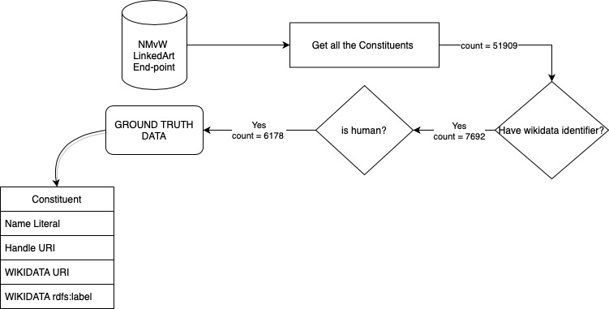
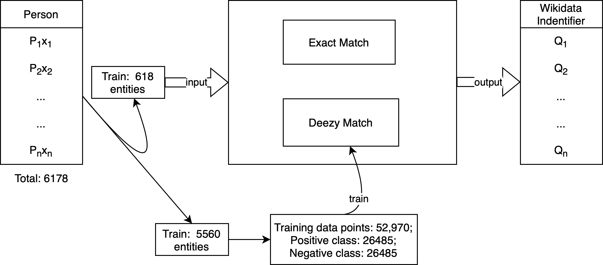

# ENTITY LINKING ON HISTORICAL DATA

### How we constructed the ground truth? 

### What is the task? 

This section discusses the string match algorithms used for entity matching only from the names of the entities, followed by the results on the given use case.

Given a set of persons $\textbf{P} = \{P_1, P_2, ... , P_n\}$ with name $x_1, x_2, ... , x_n$ respectively, retrieve the corresponding wikidata identifier $Q_1$, $Q_2$, ... , $Q_n$, assuming that one person have only one wikidata instance.
![[https://drive.google.com/drive/u/2/my-drive]]

We have 6178 instance of human entities, we we know the corresponding wikidata URI, therefore consider those human entities as our ground truth. From federated query to wikidata SPARQL endpoint, we also retrieved all the naming variation for corresponding to 6178 human listed on wikidata in different language. [Code](ttl_to_dataframe.py)

<code>select * where {  
    SERVICE <https://query.wikidata.org/sparql> {   
         <"""+var+"""> rdfs:label ?name .   
    }}</code>

We further divide this sample entities in train(90%) and test(10%) set, resulting a split of 5560 entities for training and 618 entities for test. we will report all our results based on these 618 test samples. 

### Exact string match
[Code](naive_string_matching.py)
[Result](results/naive_string_matching_618.pkl)

##### Result
Total query: 618  
Correct correspondence count: 309  
Recall: 0.5  

Total query: 618  
Total retrieved: 398  
Correct correspondence count: 309  
Precision: 0.7763819095477387  

F-measure: 0.6082677165354331

### Fuzzy string match
[Code](fuzzy_string_matching.py)
[Result](results/fuzzy_string_matching.pkl)
#### Training data
[Data construction code](deezy_match_data_construction.py)
*TODO: write a bit about the training data construction. Followed the direction from fuzzy match paper.*

##### Result
Total query: 618  
Correct correspondence count: 396  
Recall: 0.6407766990291263  

Total query: 618  
Total retrieved: 518  
Correct correspondence count: 396  
Precision: 0.7644787644787645  

F-measure: 0.6971830985915494  

### Result overview

*I intend to complete the following table*

| Method | #Query | #Retrieved URI | #Correctly Retrieved URI | Recall | Precision | F-score | 
| ----------- | ----------- | ----------- | ----------- | ----------- | ----------- | ----------- | 
| Exact String Match | 618 | 398 | 309 | 0.5 | 0.78 | 0.61
| Fuzzy String Match | 
| DeezyMatch (D:Faiss, C=3)| 618 | 518 | 396 | 0.5 | 0.78 | 0.61
| DeezyMatch (D:Cosine, C=3)| |  |  |  |  | 
| DeezyMatch (D:Faiss, C=1)| |  |  |  |  | 
| DeezyMatch (D:Faiss, C=1)| |  |  |  |  | 

where d means the distance measure used for training and c means number of candidates predicted by the algorithm.