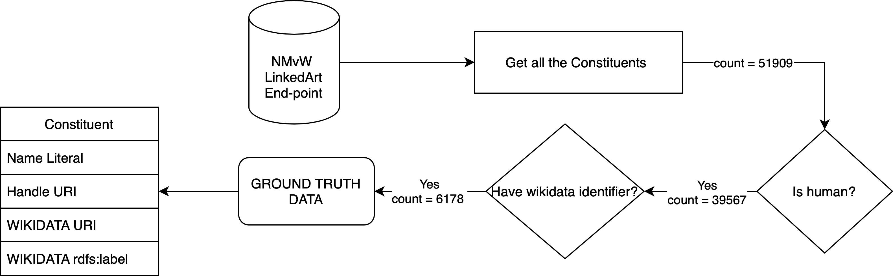

# ENTITY LINKING ON HISTORICAL DATA

## How we constructed the ground truth? 



## What is the task? 

This section discusses the string match algorithms used for entity matching only from the names of the entities, followed by the results on the given use case.

Given a set of persons $\textbf{P} = \{P_1, P_2, ... , P_n\}$ with name $x_1, x_2, ... , x_n$ respectively, retrieve the corresponding wikidata identifier $Q_1$, $Q_2$, ... , $Q_n$, assuming that one person have only one wikidata instance.

[edit image](https://drive.google.com/drive/u/2/my-drive)<br>

We have 6178 instance of human entities, where we know the corresponding wikidata URI, therefore consider those human entities as our ground truth. From federated query to wikidata SPARQL endpoint, we also retrieved all the naming variation(different language, spelling and format) for corresponding to 6178 human listed on wikidata in different language. [Code](ttl_to_dataframe.py)

<code>select * where { <br>
    SERVICE <https://query.wikidata.org/sparql> {  <br>
         <"""+var+"""> rdfs:label ?name .  <br>
    }}</code>


We further divide this sample entities in train(90%) and test(10%) set, resulting a split of 5560 entities for training and 618 entities for test. we will report all our results based on these 618 test samples. 

## Exact string match
[Code](naive_string_matching.py)
[Result](results/naive_string_matching_618.pkl)

### Result
Total query: 618 <br>
Correct correspondence count: 309 <br>
Recall: 0.5 <br>


Total query: 618 <br>
Total retrieved: 398 <br>
Correct correspondence count: 309 <br>
Precision: 0.7763819095477387 <br>


F-measure: 0.6082677165354331

For whole 39567it [14:00:57,  1.28s/it] it took 14 hrs. [Result](results/naive_string_matching_all.pkl) with 5996 return. I cannot verify whether this is a true return. 

## Fuzzy string match
[Code](fuzzy_string_matching.py)
[Result](results/fuzzy_string_matching.pkl)
#### Training data
[Data construction code](deezy_match_data_construction.py) <br>

*TODO: write a bit about the training data construction. Followed the direction from fuzzy match paper.*


### Test01 Faiss Distance with candidate 3

```from DeezyMatch import candidate_ranker

candidates_pd = \
    candidate_ranker(query_scenario=os.path.join("combined", "queries_test"),
                     candidate_scenario=os.path.join("combined", "candidates_test"), 
                     ranking_metric="faiss", 
                     selection_threshold=5., 
                     num_candidates=3, 
                     search_size=10, 
                     verbose=False,
                     use_predict=False,
                     output_path=os.path.join("ranker_results", "test01_candidates_deezymatch"), 
                     pretrained_model_path=os.path.join("models", "exp001", "exp001.model"), 
                     pretrained_vocab_path=os.path.join("models", "exp001", "exp001.vocab"))
```

618it [13:26,  1.31s/it] <br>
Total query: 618 <br>
Correct correspondence count: 395 <br>
Recall: 0.63915857605178 <br>


Total query: 618 <br>
Total retrieved: 514 <br>
Correct correspondence count: 395 <br>
Precision: 0.7684824902723736 <br>


F-measure: 0.6978798586572438 <br>
<br>
<br>


### Test02 Faiss Distance with candidate 1

```
candidates_pd = \
    candidate_ranker(query_scenario=os.path.join("combined", "queries_test"),
                     candidate_scenario=os.path.join("combined", "candidates_test"), 
                     ranking_metric="faiss", 
                     selection_threshold=5, 
                     num_candidates=1, 
                     search_size=10, 
                     verbose=False,
                     use_predict=False,
                     output_path=os.path.join("ranker_results", "test02_candidates_deezymatch"), 
                     pretrained_model_path=os.path.join("models", "exp001", "exp001.model"), 
                     pretrained_vocab_path=os.path.join("models", "exp001", "exp001.vocab"))
```
618it [12:47,  1.24s/it] <br>
Total query: 618 <br>
Correct correspondence count: 309 <br>
Recall: 0.5 <br>


Total query: 618 <br>
Total retrieved: 399 <br>
Correct correspondence count: 309 <br>
Precision: 0.7744360902255639 <br>


F-measure: 0.607669616519174 <br>


### Test03: Cosine similarity with candidate 3

```
candidates_pd = \
    candidate_ranker(query_scenario=os.path.join("combined", "queries_test"),
                     candidate_scenario=os.path.join("combined", "candidates_test"), 
                     ranking_metric="cosine", 
                     selection_threshold=.5, 
                     num_candidates=3, 
                     search_size=10, 
                     verbose=False,
                     use_predict=False,
                     output_path=os.path.join("ranker_results", "test03_candidates_deezymatch"), 
                     pretrained_model_path=os.path.join("models", "exp001", "exp001.model"), 
                     pretrained_vocab_path=os.path.join("models", "exp001", "exp001.vocab"))
```
618it [17:36,  1.71s/it]
Total query: 618 <br>
Correct correspondence count: 496 <br>
Recall: 0.8025889967637541 <br>


Total query: 618 <br>
Total retrieved: 1318 <br>
Correct correspondence count: 496 <br>
Precision: 0.37632776934749623 <br>


F-measure: 0.512396694214876 <br>

<br>
<br>

### Test04: Cosine similarity with candidate 1
```
candidates_pd = \
    candidate_ranker(query_scenario=os.path.join("combined", "queries_test"),
                     candidate_scenario=os.path.join("combined", "candidates_test"), 
                     ranking_metric="cosine", 
                     selection_threshold=.5, 
                     num_candidates=1, 
                     search_size=10, 
                     verbose=False,
                     use_predict=False,
                     output_path=os.path.join("ranker_results", "test04_candidates_deezymatch"), 
                     pretrained_model_path=os.path.join("models", "exp001", "exp001.model"), 
                     pretrained_vocab_path=os.path.join("models", "exp001", "exp001.vocab"))
```
618it [17:36,  1.71s/it]

Total query: 618 <br>
Correct correspondence count: 310 <br>
Recall: 0.5016181229773463 <br>


Total query: 618 <br>
Total retrieved: 400 <br>
Correct correspondence count: 310 <br>
Precision: 0.775 <br>


F-measure: 0.6090373280943026 <br>
<br>
<br>


### Result overview

The result tables shows experiment result while tuning distance [Faiss distance(L2-norm), Cosine similarity] and number of candidate [1, 3] parameter only.

*TODO: We can also experiment with selection thresold and search size without further training*

| Method | #Query | #Retrieved URI | #Correctly Retrieved URI | Recall | Precision | F-score | 
| ----------- | ----------- | ----------- | ----------- | ----------- | ----------- | ----------- | 
| Exact String Match | 618 | 398 | 309 | 0.5 | 0.78 | 0.61
| Fuzzy String Match | 
| DeezyMatch (D=Faiss, C=3)| 618 | 514 | 395 | 0.639 | 0.769 | 0.698
| DeezyMatch (D=Faiss, C=1)| 618 | 399 | 309 | 0.5 | 0.774 | 0.608
| DeezyMatch (D=Cosine, C=3)| 618| 1318 | 496 | 0.803 | 0.376 | 0.512
| DeezyMatch (D-Cosine, C=1)| 618 | 400 | 310 | 0.507 | 0.775 | 0.609

where d means the distance measure used for training and c means number of candidates predicted by the algorithm.

